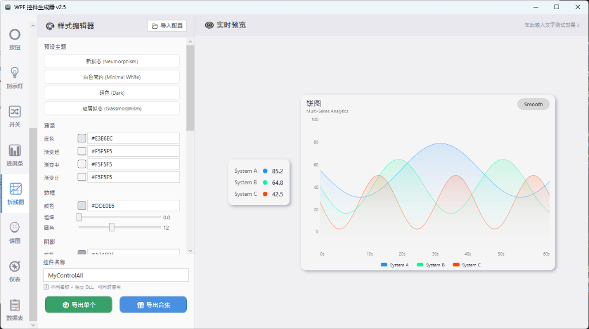
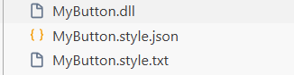

# WPF-to-LabVIEW Modern UI Generator 🚀

**一个基于 AI 辅助开发的工具套件**，致力于为古老的 LabVIEW 提供极其现代化、支持硬件加速与平滑交互的 WPF 前端控件体验。
它不仅是一套 DLL 控件库，更是一个“所见即所得”的零代码控件设计与导出工具箱。


## 🌟 核心理念与诞生背景

在这个混合编程的时代，语言的壁垒正被打破。
LabVIEW 拥有极为强大的硬件控制逻辑、测试测量 API 和成熟的 Actor Framework 架构，但在前面板 (Front Panel) 的原生控件上，却显得沉闷且过时。为了避免陷入从头使用 C# 重写整个系统的泥潭，本项目基于 **C# WPF + LabVIEW .NET 容器互操作** 构建了一个完美的桥梁：

- **底层引擎**：LabVIEW 负责所有核心逻辑与硬件通讯。
- **视觉前端**：WPF 控件以 `.NET DLL` 形式接入，负责所有的圆角、阴影、渐变、悬浮高亮以及平滑阻尼动画。
- **全栈闭环**：通过该工具，可以无需编写任何 XAML 前端代码，一键可视化配置并生成供 LabVIEW 调用的专属控件 DLL。

## ✨ 已支持的核心“五大金刚”控件
本项目目前已内置并在底层打通 LabVIEW 事件回调机制的五个高频控件：
1. `TextInput` - 文本输入框
2. `NumericDisplay` - 数值输出框
3. `Slider` - 阻尼滑动杆
4. `Button` - 流光动画按钮
5. `ComboBox` - 现代下拉列表

## 📂 项目工程结构

```text
├── ControlDesigner/    # [核心] 可视化控件生成器工具源码 (WPF)
├── ExportTemplate/     # 用于生成与打包 DLL 和 style 样式的模板库
├── UI/                 # 存放自动导出的 DLL, Json 样式及详细说明文档
├── UI.vi               # [示例] LabVIEW 调用生成 DLL 的主界面演示
├── *回调.vi            # [示例] 各类控件（如Slider/Button/Text）的 LabVIEW 事件解耦与处理流
└── README.md
```

## 🚀 快速开始与使用流程

### 1. 配置并生成你的专属控件
打开 `ControlDesigner.exe` 或直接运行 `ControlDesigner` 工程：
1. **拖拽调色**：选择你需要的圆角大小、背景颜色、字体样式及悬浮渐变色。
2. **一键生成**：调整满意后点击“导出”。
3. 随后系统将在 `UI\` 目录下自动生成**三个核心文件**：
   - **`.dll` 动态链接库**（例如 `MyButton.dll`）：供 LabVIEW 或其它第三方应用直接引用的现代化控件本体。
   - **`.style.json` 样式配置文件**：承载了您的所有视觉参数设计。后期如果需要调色或修改圆角，只需重新将其导入本工具即可进行二次创作。
   - **`.style.txt` 详细使用文档**：自动生成的纯文本保姆级说明书，里面详细记录了如何在 LabVIEW 中正确挂载此控件，以及事件回调列表与捕获方法。

   

### 2. 在 LabVIEW 中丝滑调用
1. 在 LabVIEW 的前面板放置一个 **.NET 容器**。
2. 右键容器，选择插入刚才在 `UI` 目录下生成的 DLL。
3. （核心步骤）在块图 (Block Diagram) 中拖入一个事件结构，右键配置事件以捕获该 .NET 控件的 `ValueChanged` 等关键事件（具体用法请查阅随同生成的“详细使用说明文档”及项目中现成的 `UI.vi` 演示程序）。

### 🛠️ 环境与版本支持说明
- **演示工程环境**：本仓库提供的 `UI.vi` 及各项回调演示源码，均使用 **LabVIEW 2020 (32位)** 编写。
- **动态链接库 (DLL) 兼容性**：工具导出的 `.dll` 控件支持向下兼容，最低要求 **LabVIEW 2018 及以上版本** 即可顺利调用。

## 🛑 已知限制与避坑指南 (Troubleshooting)

*   **跨线程异常处理**：加载的 .NET 控件只能在其创建线程上更新。切忌在平行的循环中直接连线更新 UI（特别是超高频刷新），请利用事件结构或我们底层预留的 `.Invoke` 机制。
*   **平台强绑定**：该方案强依赖于 Windows 下的 .NET (WPF) 框架运行库，不可直接跨越至 RT 设备或 Linux 主机。
*   **Airspace 空域问题**：当 LabVIEW 原生古典装饰框与 WPF 控件发生物理重叠时，会引发系统渲染层级错乱，请通过布局避免它们互相穿插。

## 🔮 未来的方向 (Roadmap)
这套工具目前仅是一个火花，接下来我们期望实现：
- [ ] 动态无感知的全局多主题 (Multi-theme / Dark mode) 无缝切换。
- [ ] 整合更复杂的动态图表 (Chart/Graph) 生成体系。
- [ ] 探索如何在 LabVIEW Actor Framework 等高阶架构下游刃有余地挂载这一套通用“UI 网关”。

## 🤝 贡献与参与
混合编程的革命已经打响。欢迎提交 Issue 探讨新的交互模式，或是提交 PR 补充更多的基础控件模板！

---
**开源协议 (License)**
MIT License (或者由作者自定义)
