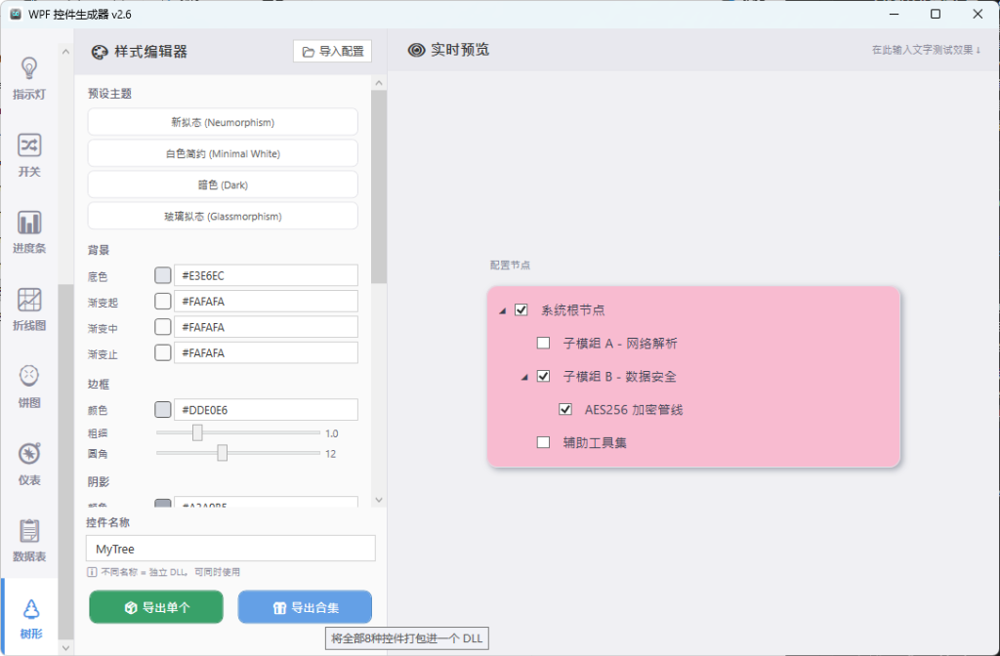
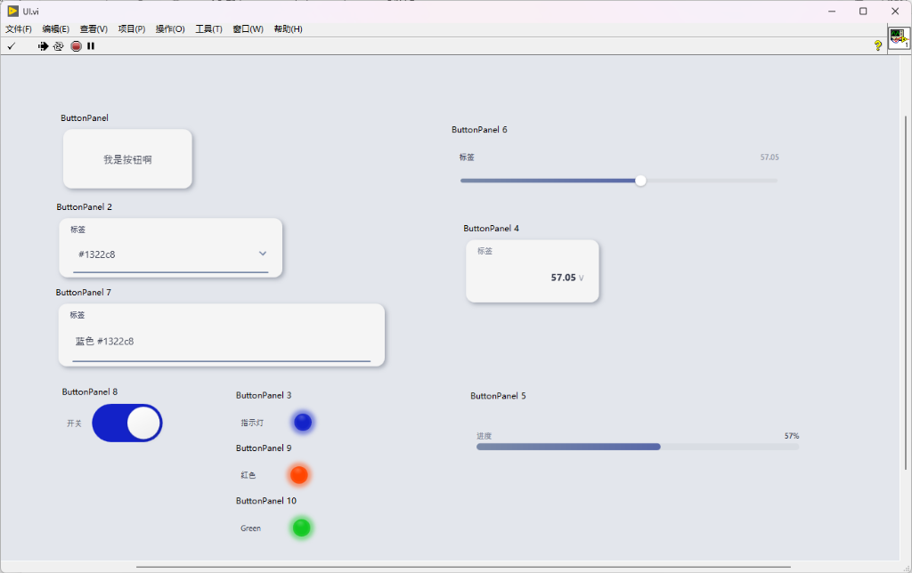

# WPF 控件生成器 v2.5 (WPF Control Generator for LabVIEW) 🚀

**一个基于 AI 辅助开发的工具套件**，致力于为 LabVIEW 提供极其现代化、支持硬件加速与平滑交互的 WPF 前端控件体验。
它不仅是一套 DLL 控件库，更是一个“所见即所得”的零代码控件设计与一键导出引擎。



## 🌟 核心理念
LabVIEW 拥有极为强大的硬件控制逻辑，但在原生 UI 上显得沉闷且过时。本工具基于 **C# WPF + LabVIEW .NET 容器互操作** 构建了一个完美的桥梁：
- **底层引擎**：LabVIEW 负责核心逻辑与通讯。
- **视觉前端**：WPF 负责圆角、阴影、渐变、悬浮高亮以及平滑阻尼动画。
- **全栈闭环**：无需 XAML 基础，无需安装 Visual Studio，一键可视化配置并生成供 LabVIEW 调用的专属 DLL。

## ✨ 已支持的全量核心控件矩阵 (v2.5)
本项目目前已内置并在底层完全打通 LabVIEW 事件与双通道色彩重绘回调机制的 **12 款** 高频工业控件：

1. `TextInput` - 文本输入框 (支持自适应与只读)
2. `NumericDisplay` - 数值输出框 (带独立单位格式渲染)
3. `Slider` - 阻尼滑动杆 (丝滑流体色彩)
4. `Button` - 流光动画按钮 (科技感触发)
5. `ComboBox` - 现代下拉列表 (高度可定制下拉箭头色彩)
6. `LED` - 高级极简指示灯 (支持 U32 及 Web HEX 变色)
7. `ToggleSwitch` - 拟态物理感开关
8. `ProgressBar` - 动态渐变进度条
9. `ChartDisplay` - 折线图/多通道波形图 (带悬浮数值观测卡盘)
10. `PieDisplay` - 精致动态饼图
11. `GaugeDisplay` - 环形仪表盘 (动态极值重绘)
12. `DataGridDisplay` - 现代数据表格 (极简斑马线与极客表头)



## 🚀 v2.5 史诗级重构更新说明 (2026-03)
在广受好评的 v2.0 基础上，v2.5 带来了数百行底层架构重构的硬核质变：

1. **图表聚合卡片引擎 (反堆叠)**：完全重写了 `Chart` 与 `Pie` 等集合类图表的配置页交互逻辑，彻底解决了属性面板无限堆叠导致的界面溢出崩溃。现在通过下拉页签优雅地独占式配置目标属性。
2. **悬浮数据侦察浮台**：为波形图实装了 `ShowSeriesCards` 属性！一键触发浮空的数据统计卡盘，实时同步跟瞄多根曲线的名称、颜色与当前最准数值。
3. **双轨制极客色彩引擎**：告别“红蓝像素反转” Bug！所有控件均升级支持极客网页格式 (`StartColor`: `#FF0000`) 与 LabVIEW 原生调色板直连 (`StartColorValue`: 32 位整型 U32 色彩)。
4. **傻瓜式全量中文 API 大满贯**：彻底杜绝导出的库缺斤少两的现状。当执行控件组导出时，生成的 `style.txt` 无条件底部挂载所有控件的**全量读写属性、事件、与高级方法名**，开箱即贴脸，极大降低连线试错成本。
5. **黑匣子防坠毁日志 (`ErrorLog.txt`)**：针对因中/英文操作系统底层编码不一而偶发的 MSBuild 编译闪退，提供了实时拦截追踪的错误日志打印。

## ⚙️ 历代沿革特性
- **免 VS 智能导出引擎 (v2.0)**：用户电脑**无需安装庞大的 Visual Studio** 即可以直接导出 DLL！系统自动侦测原生 .NET 框架进行封包。
- **Neumorphic 科技UI体验**：生成器本体使用了拟态沉浸感设计并自适应高度排版。

## 📂 项目工程结构
```text
├── WPF控件生成器.exe    # [核心] 可视化设计器(Release 2.5 正式版)
├── ControlDesigner/    # 可视化工具源码 (WPF)
├── ExportTemplate/     # 导出引擎模板工程库 (已优化，免 VS 即可直接编译)
├── Themes/             # 预设 Neumorphic 主题存储
├── UI/                 # 核心：存放一键导出的 DLL、全量 API 说明文档与错误黑匣子
└── README.md
```

## 🛠️ 环境支持
- **编译/运行环境**：Windows 10 / 11 (内置 .NET 4.8 框架即可)。
- **LabVIEW 兼容性**：支持 LabVIEW 2018 及以上版本 (32位与64位通用完美运行)。

## 🤝 贡献与参与
如果您在使用中遇到了界面绘制 Bug，或者对现有的前端体系有新的建议与工业交互需求，欢迎提交 Issue。
如果它拯救了你的上位机开发体验，请不要吝啬右上角的 **Star 🌟**！
