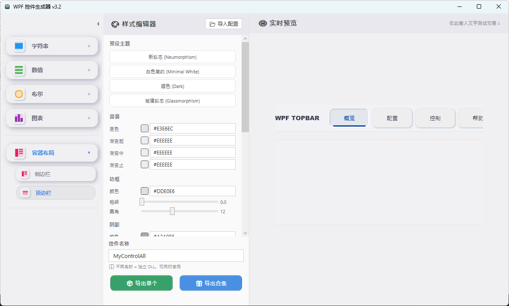
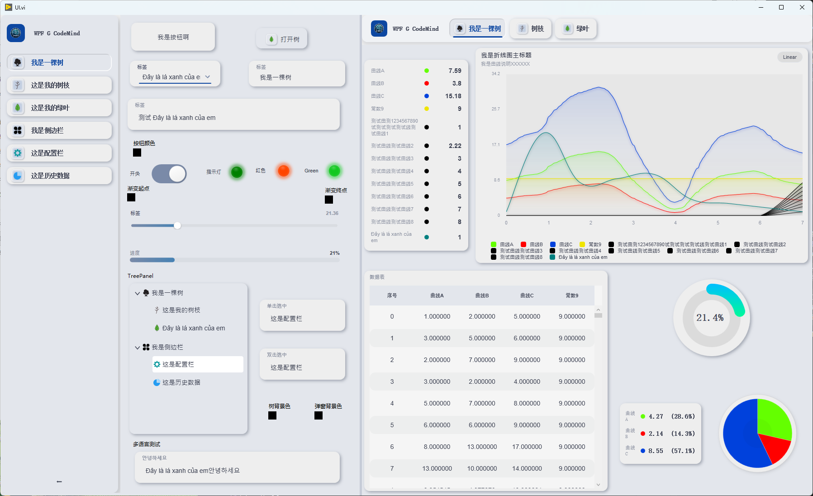

# WPF 控件生成器 v3.2 (WPF Control Generator for LabVIEW) 🚀

**一个基于 AI 辅助开发的工具套件**，致力于为 LabVIEW 提供极其现代化、支持硬件加速与平滑交互的 WPF 前端控件体验。
它不仅是一套 DLL 控件库，更是一个“所见即所得”的零代码控件设计与一键导出引擎。



## 🌟 核心理念
LabVIEW 拥有极为强大的硬件控制逻辑，但在原生 UI 上显得沉闷且过时。本工具基于 **C# WPF + LabVIEW .NET 容器互操作** 构建了一个完美的桥梁：
- **底层引擎**：LabVIEW 负责核心逻辑与通讯。
- **视觉前端**：WPF 负责圆角、阴影、渐变、悬浮高亮以及平滑阻尼动画。
- **全栈闭环**：无需 XAML 基础，无需安装 Visual Studio，一键可视化配置并生成供 LabVIEW 调用的专属 DLL。

## 🚀 v3.2 更新：页面级布局补全与字体穿透 (2026-04)

1. **全新旗舰构件：顶边导航栏 (TopbarNavPanel)**
   为了满足“传统仪表盘”与“现代管理后台”的双重需求，v3.2 引入了与侧边栏地位对等的横向导航方案。支持流体拟态交互，支持通过 API 实时增删导航标签、自定义 Logo（文字/Emoji/图片），点击项带有平滑的选中态沉降动画与底部高亮指示条。

2. **极简新成员：拟态图标按钮 (IconButton)**
   针对工具栏、设置面板等紧凑场景，推出了将图形与标签深度视觉聚合的图标按钮。支持 Emoji/字符图标与 PNG/SVG 路径图片的混合模式切换，完美复刻侧边栏的“阻尼触发”物理按压回弹手感。

3. **全量字体选择与样式穿透 (Typography Pro)**
   引入了可视化字体选择器，支持系统全量字体（如微软雅黑、Inter、HarmonyOS Sans 等）检索。优化了导出引擎，确保字体样式能够深度穿透至 `TreeView` 节点、`ComboBox` 下拉项以及 `DataGrid` 单元格等子元素，并完美支持多国语言字符集。

4. **LabVIEW 事件 100% 识别 (事件总线重构)**
   针对部分用户在 LabVIEW 事件结构中找不到回调节点的痛点，底层通过**定制化显式委托**重构了事件总线，确保 LabVIEW 能够毫秒级自动解析并生成 `ItemSelected` 和 `Click` 等精准命名的事件分支。

## ✨ 已支持的全量核心控件矩阵 (v3.2)
本项目目前已内置并在底层完全打通 LabVIEW 事件与双通道色彩重绘回调机制的 **16 款** 高频工业控件：

1. `TextInput` - 文本输入框 (支持自适应与只读)
2. `NumericDisplay` - 数值输出框 (带独立单位格式渲染)
3. `Slider` - 阻尼滑动杆 (丝滑流体色彩)
4. `Button` - 流光动画按钮 (科技感触发)
5. `ComboBox` - 现代下拉列表 (高度可定制)
6. `LED` - 高级极简指示灯 (独立支持外围圆角及变色)
7. `ToggleSwitch` - 拟态物理感开关
8. `ProgressBar` - 动态渐变进度条
9. `ChartDisplay` - 折线图/多通道波形图 (带悬浮数值观测卡盘)
10. `PieDisplay` - 精致动态饼图 (中空光影渲染)
11. `GaugeDisplay` - 环形仪表盘 (动态极值重绘)
12. `DataGridDisplay` - 现代数据表格 (极简斑马线)
13. `TreeDisplay` - 树形展示面板 (动态复选与层级响应)
14. `SidebarNav` - 拟态侧边导航栏 (支持 UI 调度与 Logo 定制)
15. **`TopbarNav` - 拟态顶边导航栏 (✨ v3.2 NEW - 水平流体导航与指示器)**
16. **`IconButton` - 拟态图标按钮 (✨ v3.2 NEW - 支持 Emoji 与图片)**



## 🕰️ 历代史诗级重构回顾

### v3.0 旗舰构件 (2026-04)
- **拟态侧边栏导航 (SidebarNavPanel)**：首个页面级布局构件，支持丝滑收缩/展开动画与左侧对齐停靠。

### v2.5 史诗重构 (2026-03)
- **图表聚合卡片引擎 (反堆叠)**：完全重写了 `Chart` 与 `Pie` 等集合类图表的配置页交互逻辑，彻底解决了属性面板无限堆叠导致的界面溢出崩溃。
- **悬浮数据侦察浮台**：为波形图实装了悬浮卡盘，实时同步跟瞄多根曲线的名称、颜色与当前最准数值。
- **双轨制极客色彩引擎**：所有控件均升级支持极客网页格式 (HEX) 与 LabVIEW 原生 32 位整型 U32 色彩直传互通。

### v2.0 前沿突破
- **免 VS 智能导出引擎**：系统自动侦测原生 .NET 框架进行封包。
- **Neumorphic 科技UI体验**：生成器本体使用了拟态沉浸感设计并自适应高度排版。

## 📂 项目工程结构
```text
├── WPF控件生成器 v2.6.exe    # [核心] 可视化设计器(Release 正式版)
├── ControlDesigner/    # 可视化工具源码 (WPF)
├── ExportTemplate/     # 导出引擎模板工程库 (已优化，免 VS 即可直接编译)
├── Themes/             # 预设 Neumorphic 主题存储
├── UI/                 # 核心：存放一键导出的 DLL、全量 API 说明文档与错误黑匣子
└── README.md
```

## 🛠️ 环境支持
- **编译/运行环境**：Windows 10 / 11 (双擎降级机制适配 .NET 4.0 ~ 4.8 框架)。
- **LabVIEW 兼容性**：支持 LabVIEW 2018 及以上版本 (32位与64位通用完美运行)。

## 🤝 贡献与参与
如果您在使用中遇到了界面绘制 Bug，或者对现有的前端体系有新的建议与工业交互需求，欢迎提交 Issue。
如果它拯救了你的上位机开发体验，请不要吝啬右上角的 **Star 🌟**！
