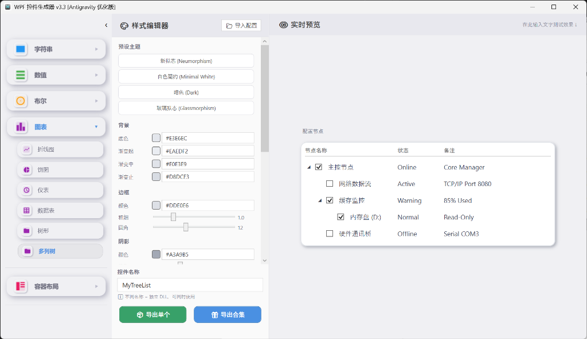
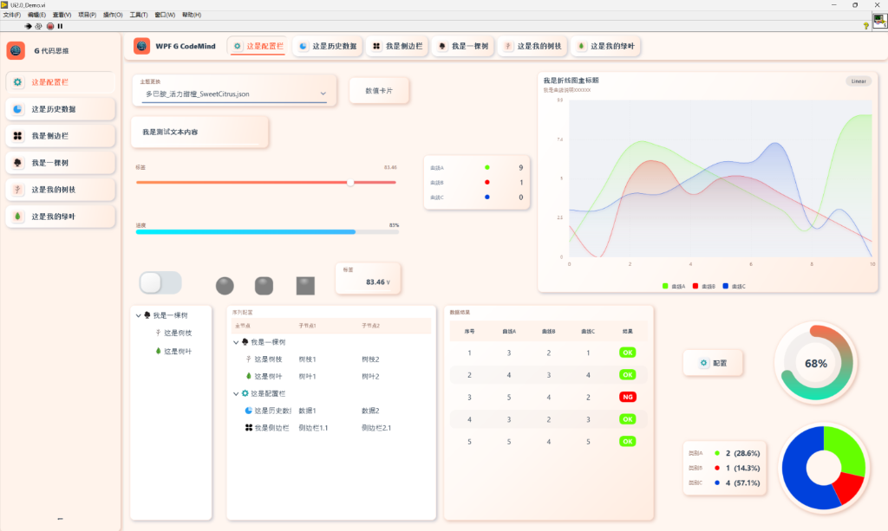
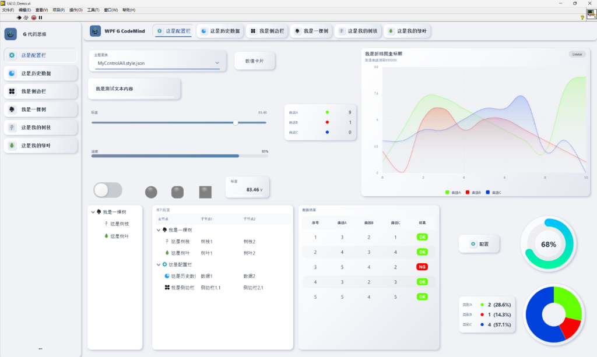
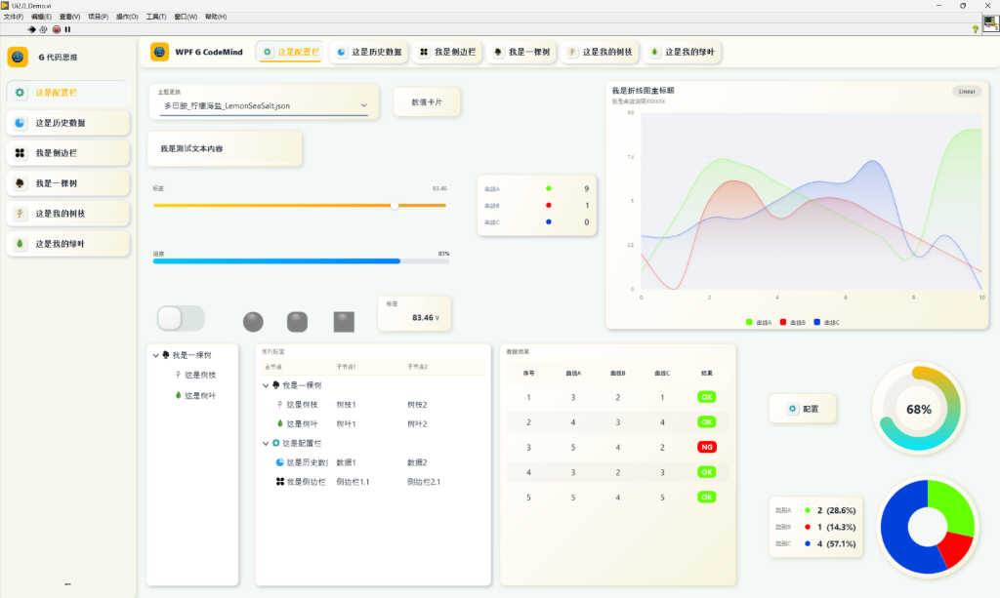
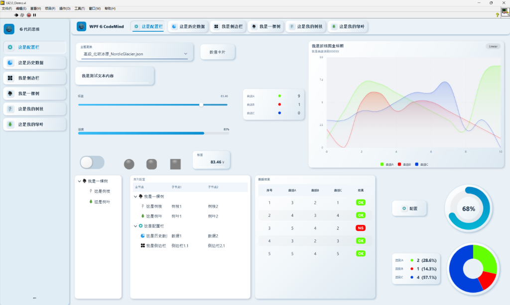
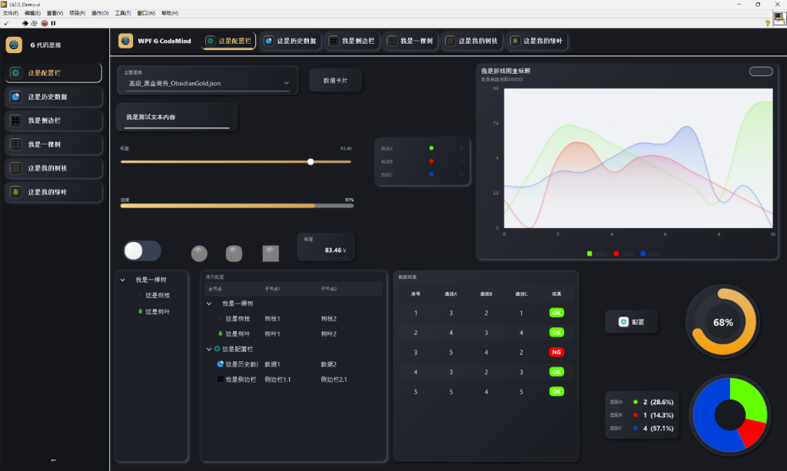

# WPF 控件生成器 v3.3 (WPF Control Generator for LabVIEW) 🚀

**一个基于 AI 辅助开发的工具套件**，致力于为 LabVIEW 提供极其现代化、支持硬件加速与平滑交互的 WPF 前端控件体验。
它不仅是一套 DLL 控件库，更是一个“所见即所得”的零代码控件设计与一键导出引擎。




## 🌟 核心理念
LabVIEW 拥有极为强大的硬件控制逻辑，但在原生 UI 上显得沉闷且过时。本工具基于 **C# WPF + LabVIEW .NET 容器互操作** 构建了一个完美的桥梁：
- **底层引擎**：LabVIEW 负责核心逻辑与通讯。
- **视觉前端**：WPF 负责圆角、阴影、渐变、悬浮高亮以及平滑阻尼动画。
- **全栈闭环**：无需 XAML 基础，无需安装 Visual Studio，一键可视化配置并生成供 LabVIEW 调用的专属 DLL。

---

## 🎨 全域现代工业主题热切换展示 (Theme Gallery)

在 LabVIEW 运行期间，通过 `UpdateStyleFromJson` 即可秒级平滑切换整套上位机风格，所有 17 类控件底色与窗口背景自动 100% 融合同步：

| 主题名称 | 风格定位 | 实测运行效果 |
| :--- | :--- | :--- |
| **经典默认**<br>`MyControlAll.style.json` | 现代极简科技白，经典沉稳 |  |
| **多巴胺 · 活力甜橙**<br>`多巴胺_活力甜橙_SweetCitrus.json` | 温暖甜橙与奶油底色，提升操作愉悦感 |  |
| **多巴胺 · 柠檬海盐**<br>`多巴胺_柠檬海盐_LemonSeaSalt.json` | 清新柠檬黄与海盐蓝调，清爽护眼 |  |
| **高级 · 北欧冰原**<br>`高级_北欧冰原_NordicGlacier.json` | 冰原淡蓝与冷色科技感，工业大屏首选 |  |
| **高级 · 黑金商务**<br>`高级_黑金商务_ObsidianGold.json` | 黑曜石深邃暗黑与流光金，尊贵奢华 |  |

---

## 🚀 v3.3 更新：复杂数据架构与全域热切换 (2026-08)

1. **全新旗舰构件：多列树形列表 (TreeListPanel)**
   - **树表融合**：将层级树（Tree）的折叠展开与数据网格（DataGrid）的多列展示深度融合；
   - **自适应列宽**：支持通过 `SetColumns` 动态分配独立列宽与自适应弹性宽度；
   - **深度遍历与父级回溯**：开放 `GetNodeColumnTexts`、`GetNodeColumnText`、`GetParentNodeId`、`GetParentNode` 与 `GetParentNodeColumnTexts` 等 API，支持完整树形结构向上回溯与列文本提取；
   - **异步懒加载与事件总线**：支持 `hasDummyChild` 展开时按需动态拉取下级数据，提供选中、双击、勾选、右键菜单等完整原生回调。

2. **全域主题运行时秒级热切换与底色无缝融合**
   - **10 套高颜值预设主题**：内置 5 套高级商务主题 + 4 套多巴胺活力主题 + 经典默认主题；
   - **双模秒级热重绘**：`UpdateStyleFromJson` 支持传入 JSON 样式文件路径或 JSON 文本纯字符串在内存中直传解析，一键重绘全量 17 类控件；
   - **多线程 UI 0 闪退保障**：彻底重构跨线程 Dispatcher 调度与 Freezable 资源所有权，根治高频多线程换肤崩溃；
   - **100% 底色融合同步**：所有控件 WinForms 面板与 WPF 根控件自动无缝融入 LabVIEW 窗体背景，消除边缘色差与白框。

3. **DataGrid 状态胶囊徽章与单格局部刷新**
   - **内嵌徽章语法**：支持 `[#HEX_OR_COLOR]Text`（如 `[#10B981]OK`、`[#EF4444]NG`）自动渲染为带高光和流光圆角的状态胶囊徽章（Badge）；
   - **单格局部更新**：新增 `UpdateCell(rowIndex, colIndex, value)` API，避免全表重绘，显著降低高频数据监测负载。

4. **单列树形控件功能增强 (TreePanel)**
   - 开放 `GetNodeText` / `GetNodeTextUTF8`、`GetParentNodeId` / `GetParentNode` 节点查询与父级遍历 API；
   - 修复鼠标选中行背景色高亮响应，优化初次加载底色与窗口背景自动一致。

5. **LED 自由形态变形与间距精修**
   - 打破正圆限制，底层重构为参数化 `Border` 多层发光与投影体系；
   - 支持在“正圆”、“圆角胶囊”、“方块”与“长条状态指示器”间自由变形与动态切换，并精简了外围冗余边距。

---

## ✨ 已支持的全量核心控件矩阵 (v3.3)
本项目目前已内置并在底层完全打通 LabVIEW 事件与双通道色彩重绘回调机制的 **17 款** 高频工业控件：

1. `TextInput` - 文本输入框 (支持自适应与只读)
2. `NumericDisplay` - 数值输出框 (带独立单位格式渲染)
3. `Slider` - 阻尼滑动杆 (丝滑流体色彩)
4. `Button` - 流光动画按钮 (科技感触发)
5. `IconButton` - 拟态图标按钮 (支持图标与标签聚合)
6. `ComboBox` - 现代下拉列表 (高度可定制)
7. `LED` - 极简指示灯 (✨ v3.3 升级 - 支持圆角自由变形与间距精修)
8. `ToggleSwitch` - 拟态物理感开关
9. `ProgressBar` - 动态渐变进度条
10. `ChartDisplay` - 折线图/多通道波形图 (带悬浮数值观测卡盘)
11. `PieDisplay` - 精致动态饼图 (中空光影渲染)
12. `GaugeDisplay` - 环形仪表盘 (动态极值重绘)
13. `DataGridDisplay` - 现代数据表格 (✨ v3.3 升级 - 单元格状态徽章与单格更新)
14. `TreeDisplay` - 树形展示面板 (✨ v3.3 升级 - 父节点回溯与选中高亮)
15. **`TreeListDisplay` - 多列树形列表 (✨ v3.3 NEW - 树表融合、独立列宽与列内容/父节点遍历)**
16. `SidebarNav` - 拟态侧边导航栏 (支持 UI 调度与 Logo 定制)
17. `TopbarNav` - 拟态顶边导航栏 (水平流体导航与指示器)

---

## 🕰️ 历代史诗级重构回顾

### v3.2 页面级布局补全 (2026-04)
- **顶边导航栏 (TopbarNavPanel)**：横向拟态导航，支持标签增删、Logo 与平滑指示条。
- **拟态图标按钮 (IconButton)**：图形与标签深度聚合的紧凑按钮。
- **全量字体穿透**：字体样式深度穿透至 TreeView、ComboBox 与 DataGrid 单元格。

### v3.0 旗舰构件 (2026-04)
- **拟态侧边栏导航 (SidebarNavPanel)**：首个页面级布局构件，支持丝滑收缩/展开动画与左侧对齐停靠。

### v2.5 史诗重构 (2026-03)
- **图表聚合卡片引擎 (反堆叠)**：完全重写了 `Chart` 与 `Pie` 等集合类图表的配置页交互逻辑，彻底解决界面溢出崩溃。
- **悬浮数据侦察浮台**：波形图实装悬浮卡盘，实时同步跟瞄多根曲线数据。
- **双轨制极客色彩引擎**：所有控件均升级支持 HEX 字符串与 LabVIEW 原生 32 位整型 (U32/I32) 颜色直传。

### v2.0 前沿突破
- **免 VS 智能导出引擎**：系统自动侦测原生 .NET 框架进行封包。
- **Neumorphic 科技UI体验**：生成器本体使用了拟态沉浸感设计并自适应高度排版。

---

## 📂 项目工程结构
```text
├── WPF控件生成器 v3.3.exe    # [核心] 可视化设计器(Release 正式版)
├── ControlDesigner/        # 可视化设计器源码 (WPF, .NET 4.0 / C# 5.0)
├── ExportTemplate/         # 导出引擎模板工程库 (免 VS 即可直接编译)
├── Themes/                 # 预设 Neumorphic 主题存储
├── UI/                     # 一键导出的 DLL、全量 API 说明文档与 LabVIEW Demo
├── History/                # 各版本 Release Notes 与 API 完整公开指导手册
├── docs/themes/            # 各主题运行效果实测截图
└── README.md
```

## 🛠️ 环境支持
- **编译/运行环境**：Windows 7 / 10 / 11 (.NET Framework 4.0 及以上)。
- **LabVIEW 兼容性**：支持 LabVIEW 2018 及以上版本 (32位与64位通用完美运行)。

## 🤝 贡献与参与
如果您在使用中遇到了界面绘制 Bug，或者对现有的前端体系有新的建议与工业交互需求，欢迎提交 Issue。
如果它提升了您的上位机开发体验，请不要吝啬右上角的 **Star 🌟**！
