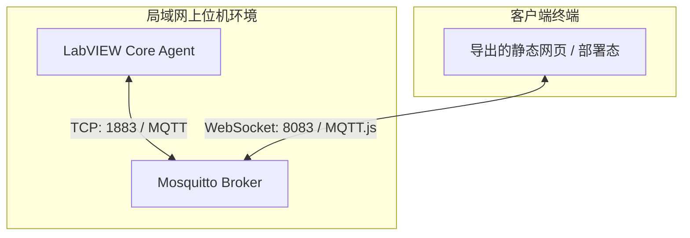

# 免技术低代码 Web 编辑器平台设计规范

本文档为面向 LabVIEW 工程师的“免代码/低代码 Web 编辑器平台”定义了系统架构、技术栈以及关键模块的实施设计。

---

## 1. 架构目标
- **零网页技术门槛**：LabVIEW 工程师无需掌握 HTML/CSS/JS，通过鼠标拖拽、对齐、属性绑定即可生成网页。
- **视觉复刻 WPF 质感**：提供与已有 WPF 样式高度一致的 Web 拟态（Neumorphic）和玻璃态（Glassmorphic）控件库。
- **免代码 MQTT 绑定**：控件状态通过 MQTT Broker 实现自动发布与订阅，与 LabVIEW 端的 MQTT 客户端无缝对接。
- **极度解耦**：编辑器导出纯静态网页包。MQTT Broker 采用独立组件（如 Mosquitto/EMQX）本地运行，确保工业级高可靠性。

---

## 2. 拓扑与数据流图



---

## 3. 布局与画布引擎设计 (Canvas Engine)
- **绝对定位画布 (Absolute Canvas)**：
  - 画布尺寸可自适应或锁定（如 1920x1080）。
  - 画布上每个组件的数据结构：
    ```json
    {
      "id": "btn_001",
      "type": "NeumorphicButton",
      "x": 120,
      "y": 80,
      "width": 150,
      "height": 50,
      "style": {
        "accentColor": "#0078D7",
        "fontSize": 14
      },
      "config": {
        "publishTopic": "device/btn_001/click",
        "subscribeTopic": ""
      }
    }
    ```
- **拖拽与辅助对齐 (Drag, Resize & Snapping)**：
  - 支持边界碰撞检测与网格线吸附（默认以 8px 像素网格对齐）。
  - 动态显示水平与垂直居中的对齐虚线（Alignment Guides）。

---

## 4. 拟态与玻璃态 UI 系统
- **CSS 新拟态参数化设计**：
  - 按钮、卡片容器通过精细调制的亮阴影与暗阴影混合复刻立体感。
  - 边框采用微渐变实现高光与阴影过渡。
- **毛玻璃效果**：
  - 用 `backdrop-filter: blur(12px)` 实现毛玻璃磨砂效果。
  - 背景色使用带不透明度的渐变色，使其在不同底色下自适应呈现。

---

## 5. MQTT 通信绑定与多路由机制
- **WebSocket MQTT.js 桥接**：
  - 浏览器通过客户端的 WebSocket 连接 Broker。
  - 输入类交互件发布值改变事件：
    - 格式：发布 Payload 可定制（原始数值或标准 JSON，如 `{"value": 1}`）。
  - 输出类显示件自动订阅 Topic，提取 JSON 属性更新界面：
    - 支持过滤字段（如：订阅 `device/status`，仅提取 `data.temp` 值赋给仪表盘指针）。
- **多页面切换 (SPA Navigation)**：
  - 支持在一套配置中创建多个画布（Page 1, Page 2...）。
  - 侧边栏菜单或按钮可通过动作属性 `action: "navigate"`，目标 `target: "Page2"` 实现无刷新跳转，伴随平滑过渡动画。
