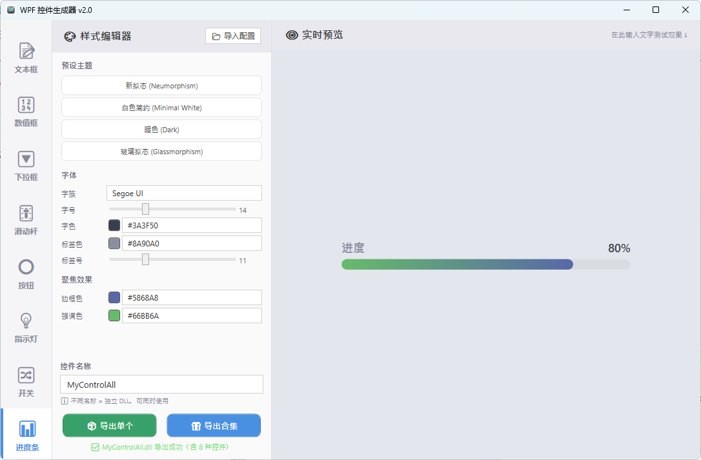
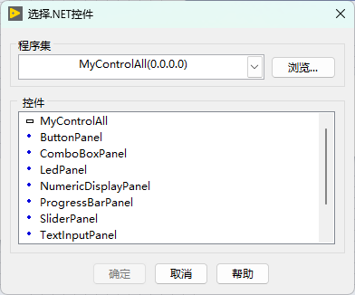
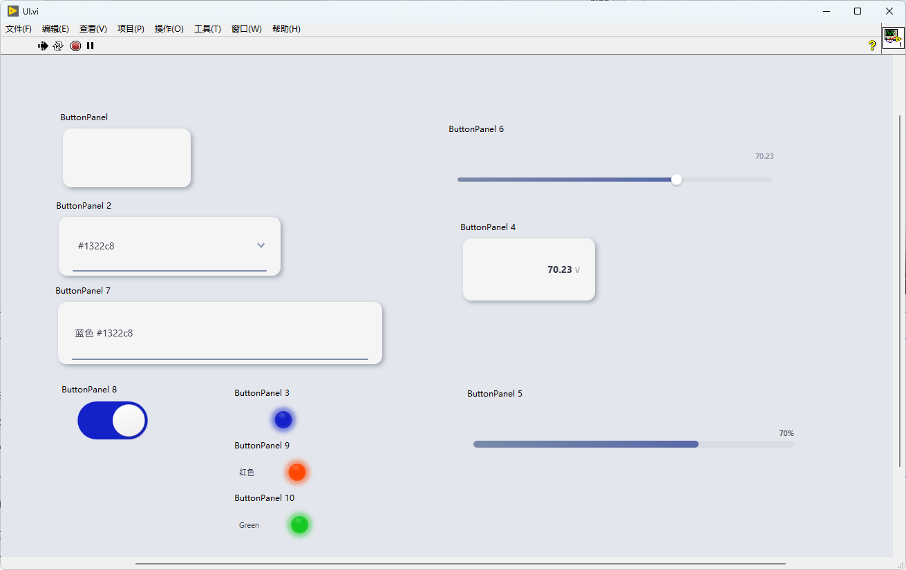

# 让 LabVIEW 界面再次惊艳：WPF 控件生成器 v2.0，这一波是“免 VS”的降维打击！

“你的 v1.0 挺好用，但要是能带个 LED 灯和开关就完美了。”  
“能不能不装 Visual Studio？我就想安静地画个 UI。”

上个月，当我把那款能一键生成 WPF 控件的工具箱开源后，后台收到了无数 LabVIEW 大佬们的“催更”私信。其实，大家的痛点我太懂了：我们是写逻辑的，不是写 C# 的，更不想为了出个 DLL 就去装那个几十 GB 的 Visual Studio。

于是，我对着 Gemini 3.1 又是一顿疯狂输出。

今天，它带着 **v2.0 进化版** 杀回来了！不仅补全了工控界最期待的“八大金刚”控件，更直接砍掉了“必须安装 VS”的硬门槛。

---

### 🚀 v2.0 的头号杀器：智能导出引擎（告别 Visual Studio！）

在 v1.0 时，导出 DLL 还需要你的电脑里躺着一个庞大的 VS 环境。
在 v2.0 中，我重构了底层的导出逻辑。现在，当你点击【导出】时，生成器会自动检索你系统内置的 .NET 编译环境，几秒钟内就能原地“无中生有”生成 DLL。

**这不仅是效率的提升，这是对“环境洁癖”工程师的终极救赎。**

<video controls="controls" src="assets/20260312-1309-32.6086709-20260312211043-9ynzs3i.mp4"></video>

**不仅仅支持单控件导出，还支持直接导出合集。**

再也不用一个一个导入dll了，一个dll直接包含所有控件。

使用说明也再次升级

<video controls="controls" src="assets/20260312-1258-41.1700396-20260312205905-vkd8fhv.mp4"></video>

---

### ✨ “八大金刚”集结：不仅是好看，更是专业

如果说 v1.0 是牛刀小试，那 v2.0 就是全副武装。我们把工控日常场景中最核心的八个控件全部“拟态化”了：

1. **LED 指示灯 (NEW)** ：支持自定义开启/关闭颜色。拒绝死板的红绿配，想要科技蓝还是高级紫？你说了算。
2. **拟态开关 (NEW)** ：像真实按键一样的触感反馈，让你的界面不再是一张平面的纸。
3. **渐变进度条 (NEW)** ：不仅显示数值，更有流光溢彩的动态视觉。
4. **文本/数值输入框**：支持自适应高度和高清渲染，告别模糊锯齿。
5. **阻尼滑动杆**：新增物理阻尼感，拖起来丝滑得不像话。
6. **流光动画按钮**：自带呼吸动效，甲方看了都想多点几次。

### 📂 更专业的品牌化升级

这次我们甚至连图标都换了！全新的 **Neumorphic（拟态）科技感图标**，配合正式更名的“WPF 控件生成器”，让你的工具箱看起来就像是一款价值数万的商业套件。

而且，所有控件现在都支持 **SetLabelVisible** 属性。想让界面极简？一键隐藏标签；想让逻辑清晰？一键显示标注。

<video controls="controls" src="assets/20260312-1302-18.3872347-20260312210309-nezs1gt.mp4"></video>

---

### 🛑 进阶避坑说明（2.0 避坑版）

虽然 2.0 极大增强了易用性，但混合编程的“底线”大家还是要守住：

1. **控件句柄回收**：虽然我们优化了加载机制，但在频繁动态创建/销毁 WPF 容器时，建议在 LabVIEW 中手动触发一次垃圾回收，保持内存平稳。
2. **DPI 缩放匹配**：WPF 是原生支持 4K 屏的。如果你的 LabVIEW 环境开启了强制 DPI 缩放，记得在前面板属性里勾选“随容器缩放”，效果更佳。

---

### 🚀 结语：让 LabVIEW 开发者更有尊严地交差

写代码最爽的时刻，莫过于甲方指着你的程序问：“你这 UI 是用什么高级前端框架写的？”
然后你淡定地回一句：“这就是原生的 LabVIEW，外加一点点 AI 的魔法。”

目前，v2.0 版本的完整源码和**免编译体验版**已经同步更新到了我的 GitHub：

👉 **GitHub 开源代码仓**：[https://github.com/tylerwind/LabVIEW-WPF-UI-Generator](https://github.com/tylerwind/LabVIEW-WPF-UI-Generator)

如果你觉得这波 2.0 的更新诚意满满，欢迎去 GitHub 赏个 **Star 🌟** ！

**获取方式**：
依旧是老规矩，扫码关注并在后台回复： **[WPF]** ，即可获取 2.0 版本的“保姆级大礼包”（内含最新 DLL、配置器、以及 LabVIEW 示例）。

混合编程的革命还在继续，正如我在 1.0 结尾说的，这仅仅是个开始。下一版本，你还想要什么？评论区告诉我！
